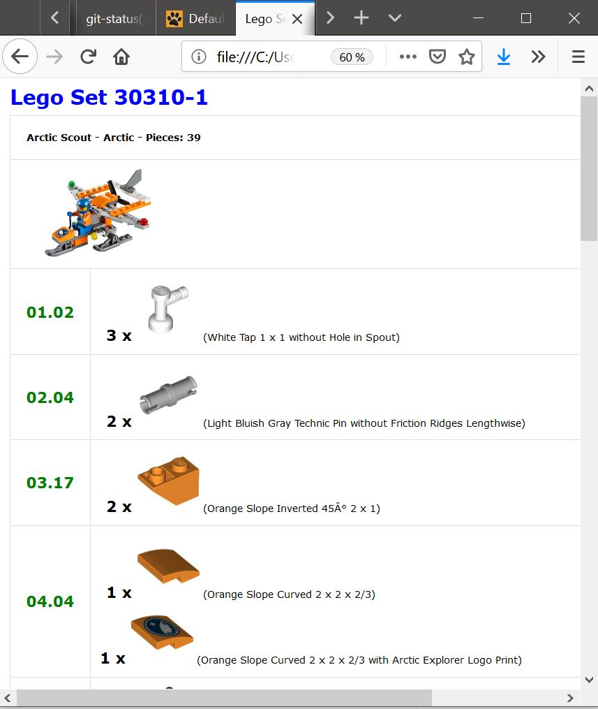
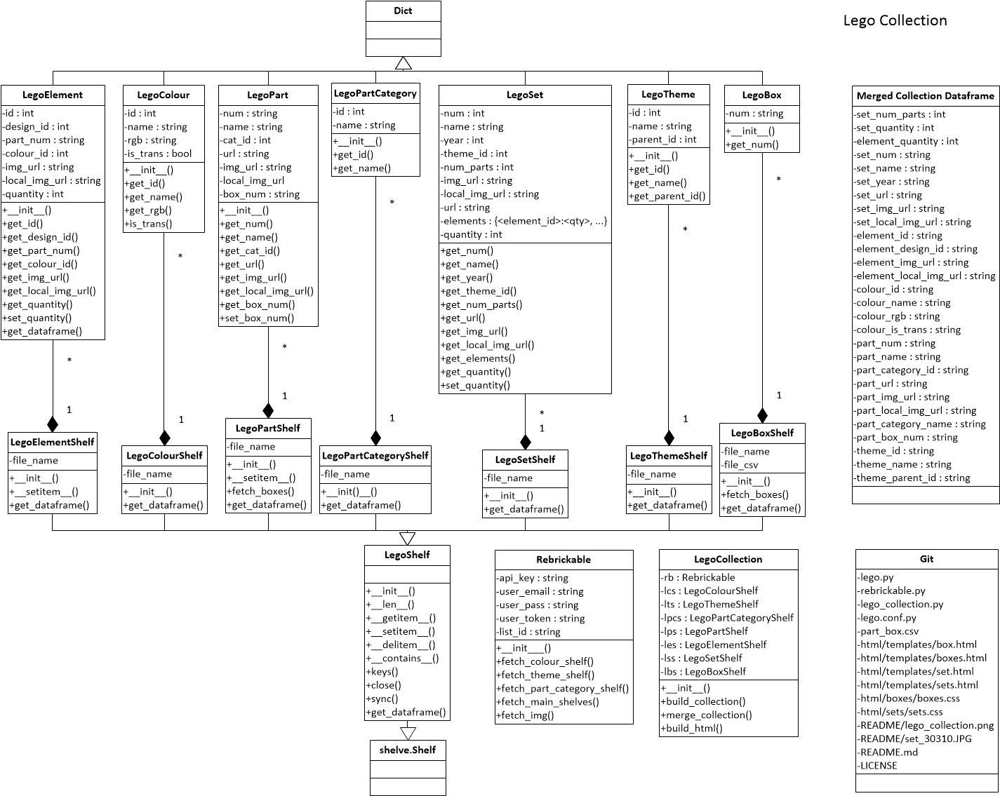

# Lego Collection
- - - -

## Personal LEGO collection management system

If you have your `LEGO` collection in [rebrickable.com](https://rebrickable.com), and you locally store your bricks per type in labelled boxes, 
then you can use this piece of software to keep track of the location of each brick type and to generate bills of materials with 
not only the list of bricks you need to build each set you own, but also with the location of the bricks in your local storage system.  

As an example, the image below displays one of the html pages generated by the application with the bill of materials for set 
30310. The box ids where each brick type is stored in my local storage system are printed in green.



The application is written in `Python 3` and uses the [rebrickable.com API](https://rebrickable.com/api/) and the 
Python packages `shelves`, `pandas` and `jinja2`. At the bottom of the page you can find a static diagram of the Python classes and their relationship.

## How to install and run

1. Download the project from [GitHub](https://github.com/aburgueno/lego-collection) and copy it to your base directory
2. Create the following directory structure from your base directory:
	* html
		* boxes
		* sets
		* templates
	* img
		* elements
		* sets
	* instructions
	* README
	* shelves
3. Modify `part_box.cvs` to match your local storage system. `part_box.cvs` contains comma separated pairs of lego element IDs and 
your local storage box IDs.
4. Create a file named `rebrickable_credentials.py` with the following three lines:
```
		api_key = 'your_rebrickable_api_key'
		user_token = 'your_rebrickable_user_token'
		list_id = 'your_rebrickable_list_id'
```
5. Run `lego_collection.py`. A menu will appear with the following four options. Go through all of them in order. 
```
	1 - Fetch your data from Rebrickable and build your local database
	2 - Build html pages for all the sets you own
	3 - Build html pages for all your storage boxes
	x - Exit
```
	
If everything went as expected, the bills of materials of all your sets and the content of your local storage boxes will be 
accessible through `html\sets\sets.html` and `html\boxes\boxes.html`, respectively. Drop me a line if you have any problems running 
this procedure.


## Static diagram 

